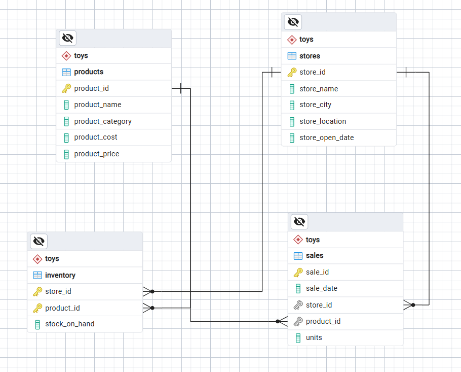

# Toys-Store-Performance-Analysis

# Project Overview 
This project analyzes sales performance for a toy retail business using PostgreSQL for data analysis and preparation, followed by Power BI for interactive dashboard visualization. The objective is to transform raw transactional data into actionable business insights by evaluating revenue, profitability, product performance, store performance, and sales trends over time.

# Data Source 
The raw dataset is sourced from the Maven Analytics Data Playground (Maven Toys Dataset).  

# Data Preparation 
The database is designed using four relational tables connected through Primary Keys (PK) and Foreign Keys (FK) to support sales performance analysis.

  

### Table Overview

| Table | Primary Key | Description |
|-------|-------------|-------------|
| `products` | `product_id` | Stores product information, including category, cost, and selling price. |
| `stores` | `store_id` | Stores information about each store, including city and location type. |
| `sales` | `sale_id` | Records individual sales transactions and links products with stores. |
| `inventory` | (`store_id`, `product_id`) | Stores the stock quantity of each product in every store. |

### Entity Relationships

- **`products` → `sales` (1:N):** One product can appear in multiple sales transactions.
- **`stores` → `sales` (1:N):** One store can have multiple sales transactions.
- **`stores` → `inventory` (1:N):** One store can have inventory records for multiple products.
- **`products` → `inventory` (1:N):** One product can have inventory records across multiple stores.

# 
